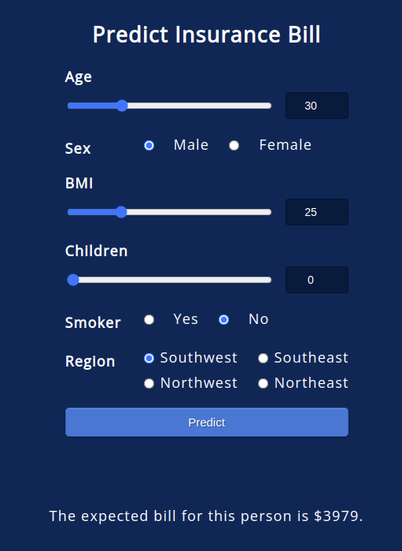

# MLOps Pipeline Deployment


<p align="center">
  
  
  
</p>

<p align="center">
  
</p>

<p align="center">
  <a href="https://insurance-predictions.azurewebsites.net/">VIEW DEPLOYED APP</a>
</p>

This project demonstrates a MLOps pipeline for deploying a machine learning model into a production-ready web application. The goal is to help an insurance company forecast patient charges using input like age, gender, BMI, number of children, and smoking status.

The solution includes:
- A **machine learning** model trained to predict insurance charges
- A **Flask back-end** to serve predictions
- A **HTML / CSS front-end** for user input
- A CI/CD pipeline with **Github Actions**
- Unit tests with **Pytest**
- Containerization with **Docker**
- Automatic cloud deployment on **Microsoft Azure**
- A product **documentation**

<p align="center">
  
</p>

<p align="center">
Architecture diagram
</p>


# Install

## Docker install (recommended)


1. Build the image

```
docker build -t insurancemodel.azurecr.io/mlops-insurance-prediction:latest .
```

2. Run the container
```
docker run -d -p 5000:5000 insurancemodel.azurecr.io/mlops-insurance-prediction
```

The web app is served on [http://localhost:5000/](http://localhost:5000/).


## Local install

1. Clone the repository

```
git clone https://github.com/PierreExeter/MLOps-Pipeline-Deployment
```

2. Install [uv](https://github.com/astral-sh/uv)

```
curl -LsSf https://astral.sh/uv/install.sh | sh
```

3. Create and activate the environment

```
uv venv --python 3.11
source .venv/bin/activate
```

4. Install the dependencies

```
uv pip install -r requirements.txt
```

5. Train the model

```
python src/train_model.py
```

6. Run the app locally

```
# development
python src/app.py

# production
python src/app.py --production
```

The web app is served on [http://localhost:5000/](http://localhost:5000/).

# Documentation

<p align="center">
  <a href="https://mlops-pipeline-deployment.readthedocs.io/en/latest/index.html">VIEW DOCUMENTATION</a>
</p>


