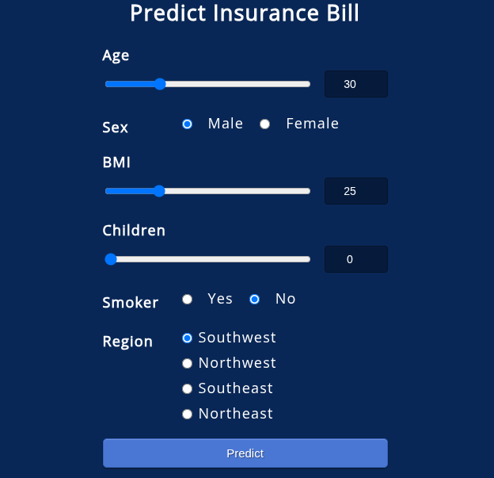

# MLOps Pipeline Deployment



This project demonstrates a MLOps pipeline for deploying a machine learning model into a production-ready web application. The goal is to help an insurance company forecast patient charges using input like age, BMI, and smoking status.

The solution includes:
- A **machine learning** model trained to predict insurance charges
- A **Flask back-end** to serve predictions
- A simple **HTML front-end** for user input
- Full containerization with **Docker**
- Cloud deployment on **Microsoft Azure**

TO ADD AS SHORT DESCRIPTION : 
A deployed machine learning model that predicts patient medical charges based on demographic and health data. Features a Flask API, a web front-end, and is containerized with Docker for deployment on Azure.

## Docker Install (recommended)

1. Clone the repository

```
git clone 
```

2. Build the image

```
docker build -t insurancemodel.azurecr.io/pycaret-insurance:latest .
```

The diferent elements are as follows: 
- Azure registry name : insurancemodel.azurecr.io
- Docker image name : pycaret-insurance
- tag : latest


3. Run the Docker container
```
docker run -d -p 5000:5000 insurancemodel.azurecr.io/pycaret-insurance
```

The web app is served on [http://localhost:5000/](http://localhost:5000/)


## Azure Deployment

1. Log in to Azure
2. Create a new Azure Container Registry (ACR), named insurancemodel.azurecr.io
3. Authenticate with Azure credentials

```
docker login insurancemodel.azurecr.io
```
The username is name of the registry, in this example "insurancemodel".
The password can be found in Azure Container Registry > Access keys. Tick the box "admin user" to reveal the password.

4. Push the image to the Azure registry
```
docker push insurancemodel.azurecr.io/pycaret-insurance:latest
```

This will take some time, depending on the size of the image.

5. Create a web app on Azure
Azure portal > create a resource > web app > create > Choose a name
 
Select the following options:
- Publish : Choose Container
- Choose a region and a pricing plan (there is a free plan).
 
6. Link the ACR image to your application

Go to the Docker tab and fill the following details:
- Source : Azure Container Registry
- Image : pycaret-insurance
- tag : latest
- port : 5000

7. The app is running and deployed on [https://insurance-predictions.azurewebsites.net](https://insurance-predictions.azurewebsites.net) 


## Local Install

1. Clone the repository

```
git clone
```

2. Install the dependencies

```
conda create -n pycaret-env python=3.11 -y
conda activate pycaret-env
pip install -U -r requirements.txt
conda install -c rapidsai -c nvidia -c conda-forge cuml
```

3. Train the model
```
python src/train_model.py
```

4. Run the app locally
```
python src/app.py
```

The web app is served on [http://localhost:5000/](http://localhost:5000/)


